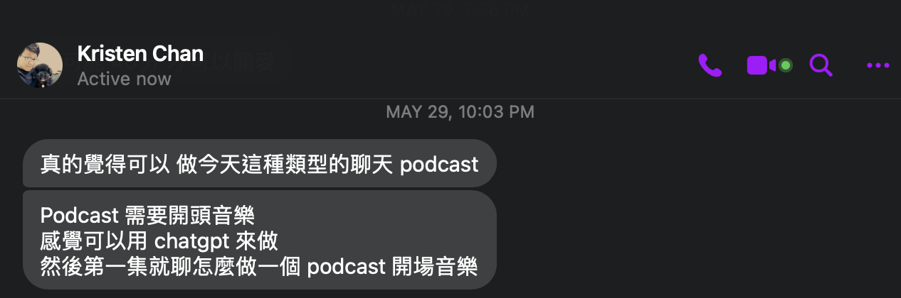
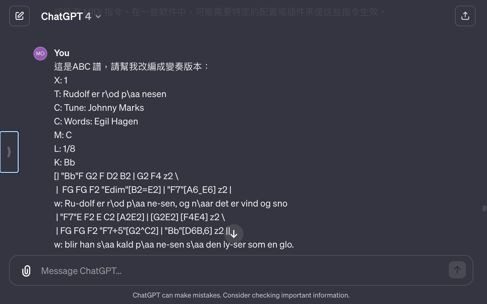

# 跟著 AI 叮叮噹～

陳奎銘 Ben Chen


---

<!-- .slide: data-background-iframe="media/Ben.html" -->


---

這不是音樂會

----


我也不是音樂人

----

我只是試著和 ChatGPT 一起學音樂

---

## Outline

- ABC Notation：
    - 做音樂之前，先學 ABC
- ChatGPT 的美麗與哀愁：
    - 我和 ChatGPT 的創作過程
- 無腦才是王道：
    - 我不想學音樂，直接生音樂給我

---

## ABC Notation

### 做音樂之前，先學 ABC

----

<!-- .slide: data-background="#FFF" -->

<!-- .slide: data-background-iframe="media/abc.html" -->


----

## What is ABC Notation

- 19世紀出現
- 以A到G的字母記錄音高
- 以數字紀錄音長
- 由克里斯·瓦爾莎發明

----


<!-- .slide: data-background="#FFF" -->

<!-- .slide: data-background-iframe="media/Jingle_Bells.html" -->

----

## How to read ABC Notation

```
X: 1 
T: Jingle Bells [A]
C:James Lord Pierpont, 1857
Z: John Chambers <jc:trillian.mit.edu>
R: march
Q: 120
M: 2/4
L: 1/8
K: A
| "A"Ec BA | E3 E/-E/ | Ec BA | "D"F4 | "Bm"Fd cB | "E7"G3 e | fe dB | "A"c4 |
| "A"Ec BA | E3 E/-E/ | Ec BA | "D"F3 F | "Bm"Fd cB | "A"ee ee | "E7"fe dB | "A"A2 z2 |
|: "A"cc c2 | cc c2 | ce A>B | "A7"c4 | "D"dd d>d | "A"dc cc/c/ |1 "B7"cB Bc | "E7"B2 e2 :|2 "E7"ee dB | "A"A4 |]
```

----


```
X: 1 #曲目號
T: Jingle Bells [A] #曲目
C:James Lord Pierpont, 1857 #作曲者 Composer
Z: John Chambers <jc:trillian.mit.edu> #轉譯者
R: march #曲風 Rhythm，進行曲
Q: 120 # 每分鐘 120 拍
M: 2/4 #拍號 Meter，每小節的拍數與節拍長度，每小節兩拍，四分音符為一拍
L: 1/8 #默認音符長度，每個英文字母代表的音符，例如：C 代表 八分音符 Do 
K: A #調性 Key，A 大調
| "A"Ec BA | E3 E/-E/ | Ec BA | "D"F4 | "Bm"Fd cB | "E7"G3 e | fe dB | "A"c4 |
| "A"Ec BA | E3 E/-E/ | Ec BA | "D"F3 F | "Bm"Fd cB | "A"ee ee | "E7"fe dB | "A"A2 z2 |
|: "A"cc c2 | cc c2 | ce A>B | "A7"c4 | "D"dd d>d | "A"dc cc/c/ |1 "B7"cB Bc | "E7"B2 e2 :|2 "E7"ee dB | "A"A4 |]
```

----


```abc [1,6|1,7|3,4,8|4,9]
| "A"Ec BA | E3 E/-E/ | Ec BA | "D"F4 | "Bm"Fd cB | "E7"G3 e | fe dB | "A"c4 |
| "A"Ec BA | E3 E/-E/ | Ec BA | "D"F3 F | "Bm"Fd cB | "A"ee ee | "E7"fe dB | "A"A2 z2 |
|: "A"cc c2 | cc c2 | ce A>B | "A7"c4 | "D"dd d>d | "A"dc cc/c/ |\
1 "B7"cB Bc | "E7"B2 e2 :|2 \

# "A" 表示 A 和弦
# E3 代表 Mi 三拍，附點四分音符
# :| 和 |: - 重複標記。位於段落開頭和結尾，表示該段落應重複演奏。
# |1` 和 |2 - 標記第一次和第二次演奏的部分

"E7"ee dB | "A"A4 |]
```

----

<iframe width="560" height="315" src="https://www.youtube.com/embed/VDsQ13vOSdA?si=256Mc6LvESItuEBx" title="YouTube video player" frameborder="0" allow="accelerometer; autoplay; clipboard-write; encrypted-media; gyroscope; picture-in-picture; web-share" allowfullscreen></iframe>

----

```
X: 1
T: Jingle Bells [A]
C:James Lord Pierpont, 1857
Z: John Chambers <jc:trillian.mit.edu>
Q: 120
R: march
M: 2/4
L: 1/8
K: A
%%MIDI program 25 % 木吉他
| "A"Ec BA | E3 E/-E/ | Ec BA | "D"F4 \
%%MIDI program 19 % 搖滾風琴
| "Bm"Fd cB | "E7"G3 e | fe dB | "A"c4 |
%%MIDI program 41 % 小提琴
| "A"Ec BA | E3 E/-E/ | Ec BA | "D"F3 F \
%%MIDI program 14 % 木琴
| "Bm"Fd cB | "A"ee ee | "E7"fe dB | "A"A2 z2 |
%%MIDI program 75 % 直笛
|: "A"cc c2 | cc c2 | ce A>B | "A7"c4 | "D"dd d>d | "A"dc cc/c/ \
%%MIDI program 114 % 牛鈴
|1 "B7"cB Bc | "E7"B2 e2 :|2 "E7"ee dB | "A"A4 |]
```

---

## ChatGPT 的美麗與哀愁
### 我和 ChatGPT 的創作過程 

----

## 是這樣開始的



----

## 我做過的嘗試

- EarSketch
- ChatGPT


----


### EarSketch

- 透過音樂創作和混音來教授 Python 和 Javascript
- 大量的音樂素材
- 素材組合成音樂片段
- 像是 DJ 的體驗網站

----

### EarSketch

一個小時我就放棄了.....<!-- .element: class="fragment" data-fragment-index="1" -->

----

### EarSketch
- 放棄的理由
    - 有四千多個音樂片段
    - 我做得很爛
        - [別人的音樂](https://earsketch.gatech.edu/earsketch2/?sharing=AzRbY74ElgfN2-tA5d-3n0E_zBFlqiqL2JJHKzMxWZk)
        - [我的音樂](https://earsketch.gatech.edu/earsketch2/?sharing=C9p2oaPUPySZrh0xXOFViGW32m5XSxrdTP7OlEU9pKc)

----

### ChatGPT

先無腦問一波


----


<!-- .slide: data-background-iframe="https://chat.openai.com/share/09a9dfb9-cd55-4fd5-a24c-d31326157830" -->


----

<!-- .slide: data-background="#FFF" -->


<!-- .slide: data-background-iframe="media/ChatGPT_init.html" -->

----

有時候，長官不知道怎麼做的時候

----

就會跟下屬說，去看同業怎麼做啊～

----

### 讓 ChatGPT 模仿一下
- [Cooley's Reel](https://editor.drawthedots.com/?t=X%3A%201%0AT%3A%20Cooley's%0AM%3A%204%2F4%0AL%3A%201%2F8%0AR%3A%20reel%0AK%3A%20Emin%0A%7C%3AD2%7CEB%7Bc%7DBA%20B2%20EB%7C~B2%20AB%20dBAG%7CFDAD%20BDAD%7CFDAD%20dAFD%7C%0AEBBA%20B2%20EB%7CB2%20AB%20defg%7Cafe%5Ec%20dBAF%7CDEFD%20E2%3A%7C%0A%7C%3Agf%7CeB%20B2%20efge%7CeB%20B2%20gedB%7CA2%20FA%20DAFA%7CA2%20FA%20defg%7C%0AeB%20B2%20eBgB%7CeB%20B2%20defg%7Cafe%5Ec%20dBAF%7CDEFD%20E2%3A%7C) ：愛爾蘭傳統舞曲


----

#### Cooley's Reel
<iframe width="560" height="315" src="https://www.youtube.com/embed/LEYMZUuFRVU?si=FUOSfZqjFaLjTI83" title="YouTube video player" frameborder="0" allow="accelerometer; autoplay; clipboard-write; encrypted-media; gyroscope; picture-in-picture; web-share" allowfullscreen></iframe>


----


### 讓 ChatGPT 模仿一下
- 改成天空之城風格的 Cooley's Reel：
[In the Style of Hisaishi from Cooley's](https://editor.drawthedots.com/?t=X%3A2%0AT%3AIn%20the%20Style%20of%20Hisaishi%20from%20Cooley's%0AM%3A4%2F4%0AL%3A1%2F8%0AR%3Aballad%0AK%3ADmin%0A%7C%3AA2%7C%22Dm%22D2%20C2%20D4%7CF4%20%22A7%22e4%7C%22Gm%22G4%20%22Dm%22A4%7C%22Gm%22G4%20%22A7%22A4%7C%0A%22Dm%22D2%20C2%20D4%7C%22A7%22F4%20%22Dm%22a2%20a2%7C%22Gm%22b2%20a2%20%22A7%22g4%7C%22Dm%22f6%20%3A%7C%0A%7C%3Aab%7C%22Dm%22d2%20C2%20d4%7C%22Dm%22d2%20C2%20%22A7%22a2%20a2%7C%22Gm%22D4%20%22Dm%22F4%7C%22Gm%22D4%20%22A7%22a2%20a2%7C%0A%22Dm%22d2%20C2%20%22A7%22d4%7C%22Dm%22d2%20C2%20%22A7%22a2%20a2%7C%22Gm%22b2%20a2%20%22A7%22g4%7C%22Dm%22f6%20%3A%7C%0A)
    - 聽起來笨重
    - 只有四分音符和二分音符

----

只好自己教 ChatGPT

----

### 教 ChatGPT 樂理


----

<!-- .slide: data-background="#FFF" -->


<!-- .slide: data-background-iframe="media/ChatGPT_teach_1.html" -->


幾乎沒有八分音符<!-- .element: class="fragment" data-fragment-index="1" -->


----

<!-- .slide: data-background="#FFF" -->

有些小節不滿拍<!-- .element: class="fragment" data-fragment-index="1" -->

<!-- .slide: data-background-iframe="media/ChatGPT_teach_2.html" -->

----

### 教 ChatGPT 樂理

- 解釋什麼叫做八分音符 
- 要求每個小節要滿拍


----

### 我被教會的事情

- 大調聽起來通常比較開朗輕快
- 花調和多聲部

----


<!-- .slide: data-background="#FFF" -->


<!-- .slide: data-background-iframe="media/ChatGPT_teach_3.html" -->


----

<iframe width="560" height="315" src="https://www.youtube.com/embed/xGW61WMopt8?si=SUh8KpQ2AAZPcNYX" title="YouTube video player" frameborder="0" allow="accelerometer; autoplay; clipboard-write; encrypted-media; gyroscope; picture-in-picture; web-share" allowfullscreen></iframe>


----

跟 GPT 協作的過程

----

就像是我是沒有技術沒有專業，卻被空降的長官

----

在指導專業的工程師做工程師不擅長的事


----

我：你可不可以這樣？

----

ChatGPT：不可以，因為布拉布拉

----

我現在我能體會長官的辛苦了，因為我真的什麼都不會= =

----

### 快速讓 ChatGPT 產出音樂的方法

- 找到喜歡的曲子
    - https://abcnotation.com/
- Prompt：
> 這是ABC 譜，請幫我改編成變奏版本
- 再依樂理，要求 ChatGPT 調整
    - 節奏快慢
    - 改變調性
    - 符合樂理
    - 增加打擊樂器

----

### 快速讓 ChatGPT 產出音樂的方法



----

有沒有更無腦的做法？

---

## 無腦才是王道
### 我不想學音樂，直接生音樂給我

----

## 無腦的音樂生成

- 免費
    - MusicGen
    - 雅婷 AI-Music
- 付費
    - Soundful
    - Soundraw
    - Mubert


----

## <font color='black'>`MusicGen`</font><!-- .element: class="fragment" data-fragment-index="1" -->

- https://huggingface.co/spaces/facebook/MusicGen<!-- .element: class="fragment" data-fragment-index="2" -->

- <font color='black'>上傳音樂</font><!-- .element: class="fragment" data-fragment-index="3" -->
- <font color='black'>使用 Prompt</font> <!-- .element: class="fragment" data-fragment-index="4" -->
- <font color='black'>串接麥克風</font>  <!-- .element: class="fragment" data-fragment-index="5" -->
- <font color='black'>只有 15 秒</font> <!-- .element: class="fragment" data-fragment-index="6" -->

<!-- .slide: data-background="#FFF" -->
<!-- .slide: data-background="media/musicgen.png" -->


----

## 付費 AI 音樂平台
- Soundful
    - Genre x Style
    - https://my.soundful.com/s/rnb/rnb_wavy/657ce8e5efbfe369b1eaeb9d
- Soundraw
    - Genre x Mood x Theme
    - https://soundraw.io/edit_music?m=657cdc43630d8e000a386847
- Mubert
    - Genre or Prompt or Image

----

https://music.yating.tw/music<!-- .element: class="fragment" data-fragment-index="1" -->

<!-- .slide: data-background="media/AI-Music-Yating.png" -->

----

<!-- .slide: data-background-iframe="https://wall.sli.do/event/945jXAM2FrJxmnCn6svTxs?section=c014bbfe-2381-4e97-9000-04ebcf75e6e5" -->

---

## 徵才

|   Data 人才趕快來  |     直接跟 Ben 聯絡      |
|:-----------------:|:-----------------------:|
|  |  |
|<font size=5>https://www.onelab.tw/Partner.html</font> | <font size=5>benjamin0901@gmail.com</font> |


---

# 投影片

---

# `Thank You`

----

試著改編 ChatGPT 產生的譜會發生什麼事？

----

